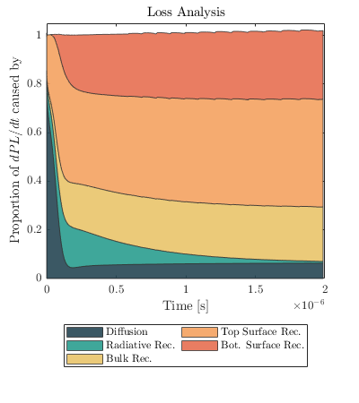
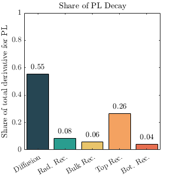
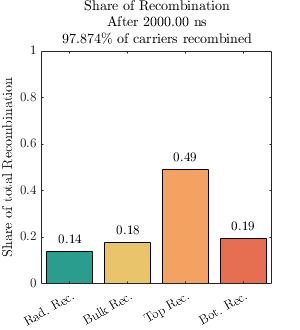

# Attribution of sources

## License
This code is distributed under the Creative Commons Attribution-NonCommercial 4.0 International license. 

## Requirements
This code requires the `Matlab` software as well as the `pdepe` code
## Description

  

Output from the code: at each time the reasons for the decay to happen are compared and quantified one against the other.

## Inputs
The inputs are mainly the parameters of the layer, its bulk and interface recombination parameters as well as the duration of the pulsed laser. 

## Outputs

  
  

1. Reason of the decay of PL integrated over the time of the simulation.
2. Percentages of total recombination as a function of recombination channel.

## Equations solved
### The drift diffusion equation
This code assumes an **intrinsic** material. The excess carrier density is noted $n(z,t)$. The main equations are:

$$\frac{\partial n}{\partial t} = D\frac{\partial^2 n}{\partial z^2} + G(z,t) - R(z,t)$$

With the following definition for generation:

$$ G(z,t) = n_\gamma \alpha e^{-\alpha z} \times \frac{1}{\sqrt{2\pi}\sigma} e^{-\frac{(t-t_0)^2}{2\sigma^2}}$$

The following definition for recombination applies:

$$R(z,t) = k_1  \frac{n^2 - n_i^2}{n + N_{bulk}} + k_2(n^2 - n_i^2) $$

The interface conditions applied are the following:

$$ \frac{dn}{dz}(z=0,t) = - S_{top}\frac{n(z=0,t)^2 - n_i^2}{n(z=0,t) + N_{top}}$$
$$ \frac{dn}{dz}(z=L,t) = S_{bot}\frac{n(z=L,t)^2 - n_i^2}{n(z=L,t) + N_{bot}}$$

The equations are solved and give the numerical solution of $n(z,t)$ on a given interval of time and space provided. 

### Using the solution to compute the contributions as a function of time
From the intrinsic definition of the PL (see[^1] and [^2] for more details):

$$I_{PL}(t) \propto \int_0^L dz \ (n(z,t)^2-n_i^2)$$

One can compute the time derivative of the PL intensity and plug in the drift diffusion equation to find: 
$$      \frac{dI_{\text{PL}}}{dt}(t)$$
$$=-2A \left[ \underbrace{k_1\int_{0}^{L}{dz\ \Delta n^2}}_{\mathrm{(i)}}+\underbrace{S_{top}\Delta n^2\left(z=0,t\right)}_{\mathrm{(ii)}}  +\underbrace{S_{bot}\Delta n^2\left(z=L,t\right)}_{\mathrm{(iii)}}+\underbrace{D\int_{0}^{L}{dz\ \left(\frac{\partial\Delta n}{\partial z}\left(z,t\right)\right)^2}}_{\mathrm{(iv)}} +\underbrace{k_2\int_{0}^{L}{dz\ \Delta n^3}}_{\mathrm{(v)}} \right]$$

Each of these terms can be plotted as a share of the total variation for each instant of time. This allows to plot the instantaneous contributions as shown above.

Sources:
[^1]: Guillaume Vidon, Why do decays decay? Transport and recombination dynamics of solar cells revealed via time resolved photoluminesence imaging: application to hybrid perovskites, 2022 PhD Thesis 
[^2]: 
Maiberg, M., &#38; Scheer, R. (2014). Theoretical study of time-resolved luminescence in semiconductors. II. Pulsed excitation. <i>Journal of Applied Physics</i>, <i>116</i>(12), 123711. https://doi.org/10.1063/1.4896484
